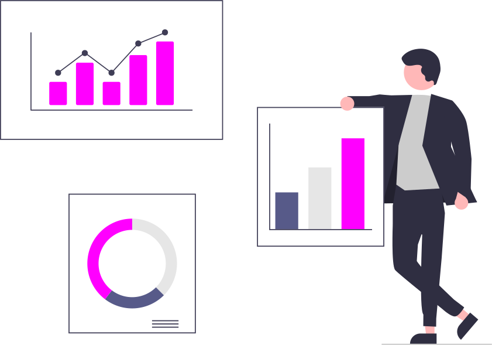

ALL.addEventListener('click', () => {
    Title.innerHTML = 'Test All';
    Link.style.display = 'block';
    txetContent.style.display = 'none';
    txetContent2.style.display = 'block';
    txetContent2.innerHTML = `

    

        <h3>  What is Software automation?</h3> 
        
 Testing Automation Software Testing:  
            is a process, to evaluate the funetionality of a software application with an intent to find
            whether the developed software
            met the specified requirements or not and to identify the defects to ensure that the product
            is defect-free to produce a quality produet, Software testing is also used to test the
            application from load, performance, and stress points of view. Software Testing Automation:
            This is an Automatic technique where the tester writes scripts by own and uses suitable
            software to test the software.
            It is basically an automation process of a manual process, Like regression testing.
        <h3> What can automation software do for me?</h3> 
        
- Helps you maintain compliance - Improved accuracy and quality 
            - Reduces cost   - Improved customer experience

    

    

            
    

`;
})